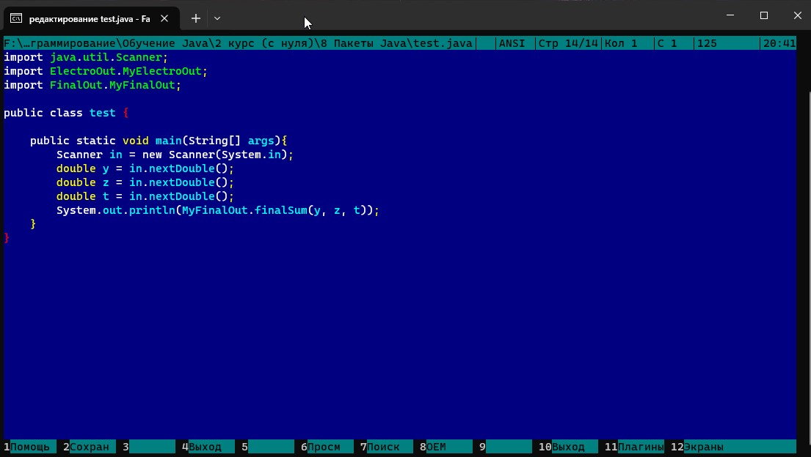
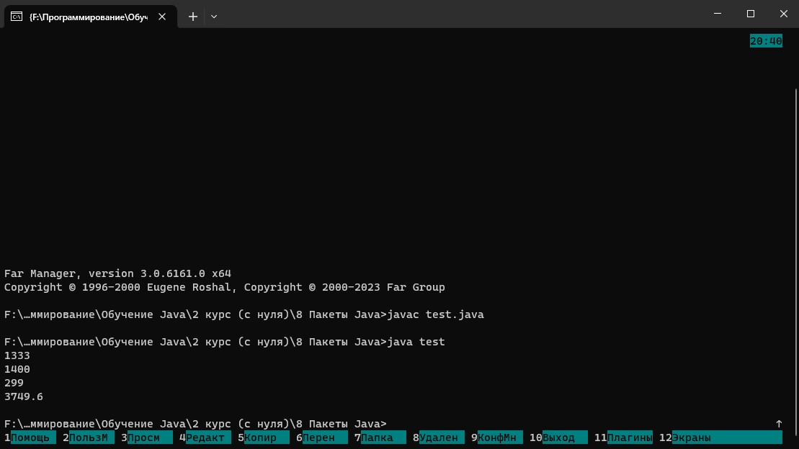

# Packet Java
---
## Задание:

### Первый пакет в редакторе:
.jpg)

### Первый пакет (компиляция):
.jpg)

### Второй пакет в редакторе:
.jpg)

### Второй пакет (компиляция):
.jpg)

### Java файл в редакторе:

### Компиляция java файла:
.jpg)

### Результат программы:

